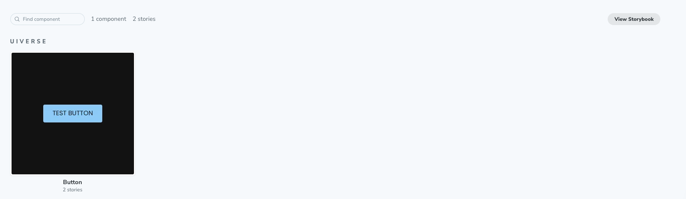

# DesignOps Guide: Using Chromatic with Uiverse


## Table of Contents

- [DesignOps Guide: Using Chromatic with Uiverse](#designops-guide-using-chromatic-with-uiverse)
  - [Table of Contents](#table-of-contents)
  - [Developer Guide: Creating Storybook Examples](#developer-guide-creating-storybook-examples)
  - [Designer Guide: Reviewing Builds on Chromatic](#designer-guide-reviewing-builds-on-chromatic)
  - [Connecting Figma with Chromatic](#connecting-figma-with-chromatic)

## Developer Guide: Creating Storybook Examples

When developers write a component or components, they need to create Storybook examples that designers can review. The process is as follows:

1. **Create a New Branch**: Start by creating a new branch from the `develop` branch.

   ```bash
   git checkout develop
   git pull origin develop
   git checkout -b feature/your-component-name
   ```

2. **Develop Your Component**: Write your component code in the components directory.

3. **Add Storybook Examples**: Create Storybook stories for your component in the `src/stories` directory.

4. **Commit and Push**: Commit your changes and push the branch to the remote repository.

   ```bash
   git add .
   git commit -m "Add YourComponent and Storybook examples"
   git push origin feature/your-component-name
   ```

5. **Test Locally with Storybook**: Run Storybook locally to test your components.

   ```bash
   npm run storybook
   ```

6. **Upload to Chromatic**: Once your components are ready and tested locally, upload the Storybook examples to Chromatic.

   ```bash
   npm run chromatic
   ```

7. **Create a Pull Request**: Open a pull request from your feature branch to the `develop` branch for review.


8. **Designer Review**: Designers will review the Storybook examples and provide feedback.

9. **Incorporate Feedback**: Make any necessary changes based on designer feedback and update the pull request.

10. **Merge**: Once approved, merge the feature branch into the `develop` branch.

By following this process, developers can ensure that their components are reviewed and approved by designers before being merged into the main codebase.

## Designer Guide: Reviewing Builds on Chromatic

When a developer has created a build for the current branch and uploaded it to Chromatic, designers can follow these steps to review the components:

1. **Access Chromatic**: Open the Chromatic dashboard and navigate to the project associated with the current branch.

2. **View Builds**: In the Chromatic dashboard, you will see a list of builds. Each build corresponds to a specific branch or feature.

3. **Select the Build**: Click on the build for the current branch that you want to review. This will open the build details page.


4. **Review Components**: On the build details page, you can see all the Storybook stories that have been uploaded. Review the components by navigating through the stories and checking their appearance and behavior.





5. **Provide Feedback**: If you find any issues or have suggestions, provide feedback directly in Chromatic by adding comments to the relevant stories. You can also communicate with the developer through your preferred communication channels.


6. **Approve or Request Changes**: Once you have reviewed the components, you can either approve the build if everything looks good or request changes if there are issues that need to be addressed.


7. **Follow Up**: If changes are requested, the developer will make the necessary updates and upload a new build to Chromatic. Repeat the review process for the new build.

By following this process, designers can ensure that the components meet the design requirements and provide a seamless user experience before they are merged into the main codebase.

## Connecting Figma with Chromatic

To connect Figma with Chromatic, follow these steps:

1. **Install the Figma Plugin**: Install the Chromatic Figma plugin from the Figma community.

2. **Link Your Figma Account**: Open the plugin and link your Figma account with Chromatic by following the on-screen instructions.

3. **Select Figma Frames**: Choose the Figma frames that you want to connect with Chromatic. These frames will be used to generate visual snapshots.

4. **Upload to Chromatic**: Use the plugin to upload the selected frames to Chromatic. This will create visual snapshots that can be reviewed alongside your Storybook components.

By connecting Figma with Chromatic, you can ensure that your design and development workflows are aligned and that visual changes are tracked effectively.
