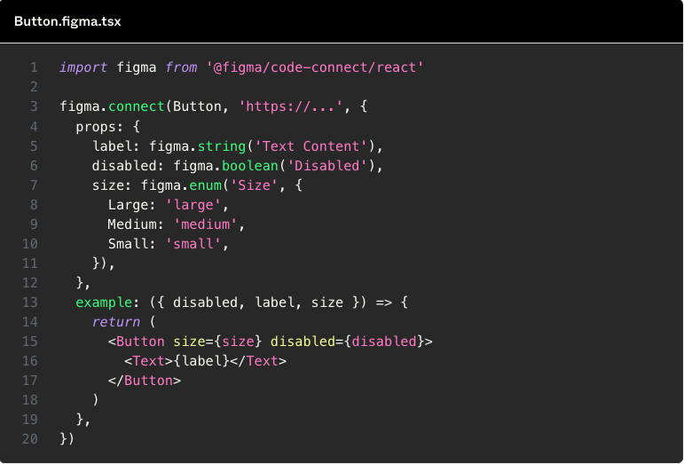
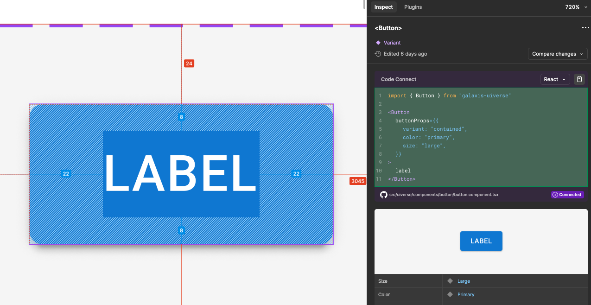
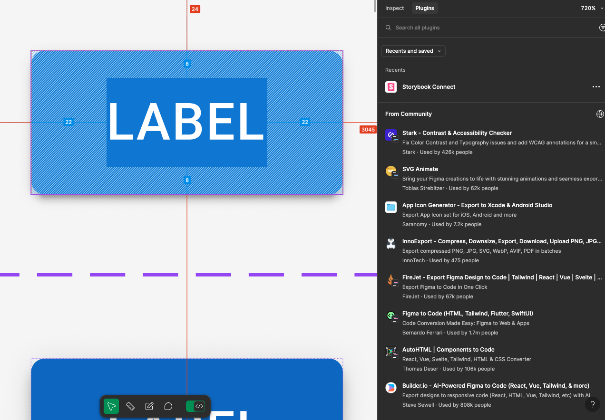
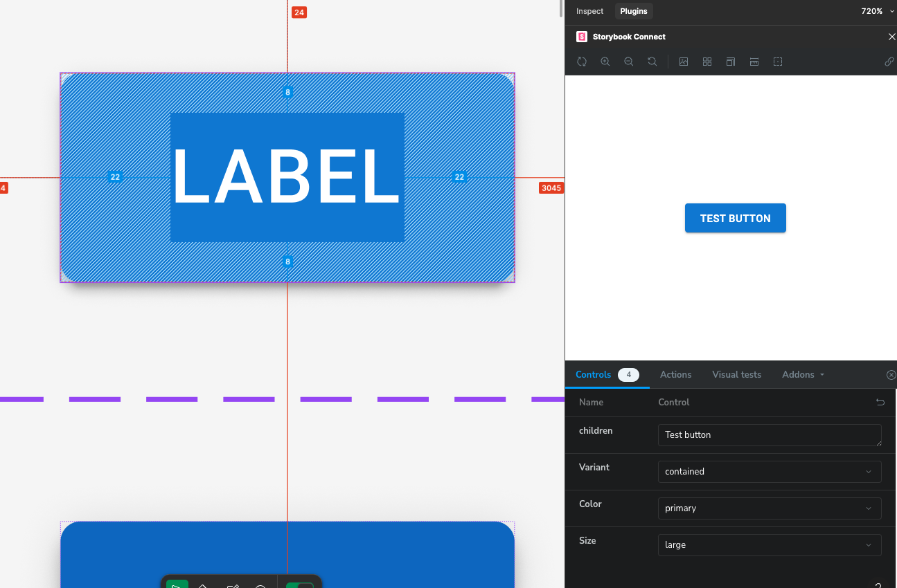

# Figma Dev Mode: A Quick Guide

The Figma Dev Mode is a powerful feature designed to enhance the workflow between designers and developers. Follow these steps to enable and utilize it effectively:

## 1. Open the Figma File

Start by opening the relevant Figma file that you want to work with. Ensure you have the necessary permissions to access and edit the file.

## 2. Locate the Toolbar

At the bottom of the Figma interface, you will see a toolbar. This toolbar contains various tools and settings that are essential for customizing your workspace.

## 3. Enable Dev Mode

Within the toolbar, you will find an option to enable Dev Mode. Click on this option to activate the developer-specific features. Once enabled, you will gain access to additional tools that simplify the process of inspecting designs, copying code snippets, and extracting assets.

## 4. Access the Inspect Menu

After enabling Dev Mode, navigate to the right side of the interface where you will find the Inspect Menu. This menu provides detailed information about the selected component, including properties, CSS code, and assets.

### Try Out Components in the Playground

Within the Inspect Menu, you can use the Playground feature to experiment with the selected component. By adjusting the properties, you can see how the component’s appearance changes in real time. This is particularly useful for fine-tuning designs and ensuring consistency.

### Dynamic Properties and Code Connect

When using Code Connect, uploaded code can dynamically update in the Playground if it utilizes properties linked from Figma. This allows for real-time testing and visualization of how dynamic properties affect the component’s behavior and appearance. It’s a seamless way to bridge the gap between design and implementation.

This is an example for dynamic properties:

### Published Code in the Inspect Menu

Code published through Code Connect is also accessible in the Inspect Menu. Here, developers can review the integrated code and see how it can be utilized directly from the installed package. This streamlined approach ensures clarity and ease when working with shared components in a codebase.

## 5. Leverage Plugins for Enhanced Functionality

In addition to the Inspect Menu, various plugins can be utilized to extend functionality. For example, the Storybook plugin allows you to connect with the integrated code and interactively test pre-built components. By linking Storybook to your connected codebase, you can explore how components behave, validate their implementation, and ensure alignment between design and code.

### Viewing Stories in Storybook

Opening Storybook enables you to see the pre-written stories for each component. These stories showcase different states and variations of the component, which you can interactively test. This hands-on approach helps in validating the behavior and appearance of components within their intended context.

## References

- [Guide to Dev Mode](https://help.figma.com/hc/en-us/articles/15023124644247-Guide-to-Dev-Mode)
- [Code Connect Documentation](https://www.figma.com/code-connect-docs/)
- [Code Connect for React](https://www.figma.com/code-connect-docs/react/)
- [Code Connect for Storybook](https://www.figma.com/code-connect-docs/storybook/)
